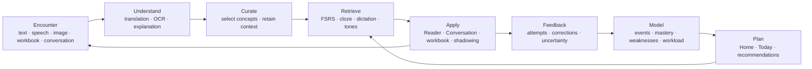
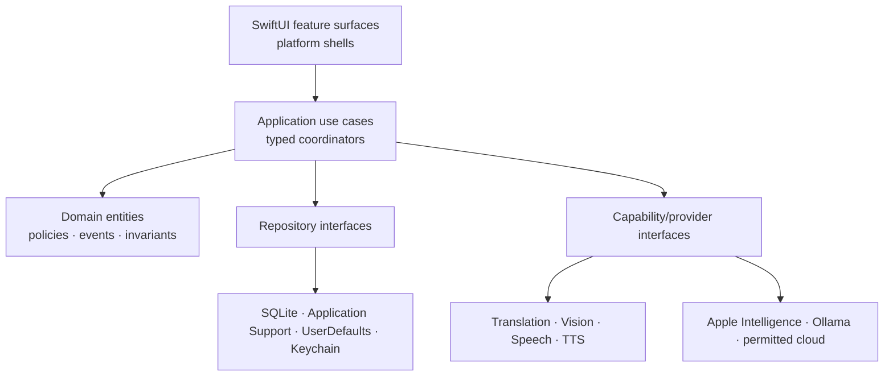
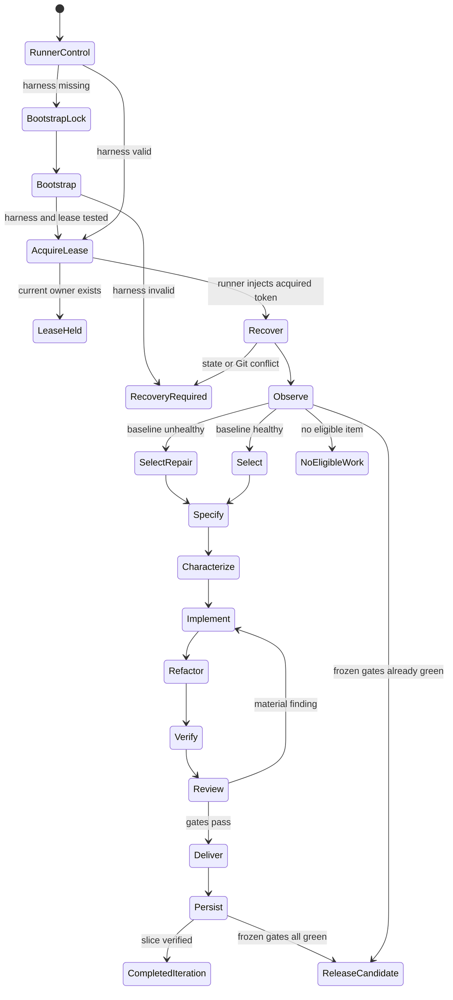

# CODEX_LOOP.md — SwiftMandarin Product and Autonomous Engineering Constitution

**Document status:** Target-state specification and executable agent loop

**Created:** 2026-07-10

**Primary audience:** Autonomous coding agents working in this repository

**Secondary audience:** Human product owners, reviewers, and release operators

This document defines two things:

1. The ideal, integrated, ready-to-ship state of SwiftMandarin.
2. The bounded autonomous loop that repeatedly moves the current repository toward that state.

It is both a product constitution and an engineering control system. It is not a claim that the current app already has every capability described below.

The constitutional layer is limited to learner promises, safety/privacy invariants, evidence standards, and authority boundaries. Concrete storage engines, type names, coordinators, router shapes, performance methods, and harness implementations are a **reference architecture** until adopted by a versioned architecture decision record (ADR). An implementation MAY replace a reference mechanism when it preserves the same observable contract and supplies equal or stronger evidence.

The words **MUST**, **MUST NOT**, **SHOULD**, **SHOULD NOT**, and **MAY** are normative. Runtime system instructions, the current user request, repository-local instructions, and tool permissions always outrank this file.

---

## 0. How an agent should use this document

At every fresh context, the coordinator should distinguish three kinds of truth:

| Question | Authority |
|---|---|
| What does the app do now? | Current source, current build/test output, current data fixtures, and current runtime evidence |
| What verified problems exist? | Revalidated items from `CODEX_RECOMMENDATIONS.md`, issue trackers, reviews, and reproducible user reports |
| What should the product become? | This document, amended only through an explicit recorded product decision |
| What is happening in the current iteration? | Git-common-dir canonical state; tracked `CODEX_LOOP_STATE.json` checkpoint; feature/progress/handoff views; Git state; and evidence files |

The agent MUST NOT describe a target capability as implemented without current evidence. It MUST NOT treat an old audit as current truth without reopening the relevant source. It MUST NOT change this constitution merely to make an implementation easier.

### Governance and authority records

Repository files cannot grant the agent authority. The runner injects current capabilities, and `CODEX_AUTHORITY.md` records human-authored standing grants for auditability. Each grant names the issuer, repository and remote, permitted actions and objects, expiry, data boundary, and cost ceiling. An agent MAY propose a change to this file but MUST NOT approve or broaden its own authority.

Material product, release-scope, architectural, or constitutional decisions live in `docs/decisions/ADR-YYYYMMDD-slug.md` with: status, context, decision, alternatives, consequences, approver/source, approval date, and any superseded decision. Only a human product owner may approve:

- A change to the product promise, supported learner profile, deliberate non-goals, or frozen release scope.
- A change to priority weights, ship gates, privacy posture, legal claim, or authority boundary.
- A new capability that expands collected data, off-device processing, permissions, or advertised platforms.

The agent may autonomously admit a currently observed P0/P1 defect when it violates an already frozen promise. It may not promote a new feature or capability into a frozen milestone without a human-approved decision, unless a standing experiment grant explicitly covers that class of low-risk experiment.

### Relationship to `LOOP.md`

`LOOP.md` is an earlier vision and seed-idea inventory committed during this work. `CODEX_LOOP.md` is the current authoritative constitution for product scope, evidence, safety, release convergence, and runner behavior. Read `LOOP.md` for candidate inspiration only. Where they conflict—such as guaranteed bidirectional pedagogy, immediate knowledge-graph adoption, a backlog designed never to empty, or literal self-reprompting—this file and the active human-approved milestone govern. A useful idea from `LOOP.md` enters through the normal candidate/admission process rather than bypassing it.

This file cannot literally wake or prompt an agent by itself. Continuous operation requires an external Codex automation, orchestrator, or human to start each run with the canonical prompt near the end of this document. All meaningful state is therefore externalized into repository artifacts so a new agent can resume after context loss.

### Current starting point

As of this document's creation, SwiftMandarin already has substantial product breadth:

- A five-tab iOS/iPadOS shell and a macOS sidebar.
- Home, typed translation, live speech, OCR/photo/screenshot capture, vocabulary, FSRS review, quiz, dictation, tone drills, Reader, AI Conversation, workbook grading, History, Stats, Phrases, App Intents, and a menu-bar surface.
- On-device Apple frameworks, local Ollama, Apple Intelligence, and configurable cloud providers.
- English and Simplified Chinese application localization.
- A privacy manifest and localized permission descriptions on the current Codex branch.

The repository also contains verified cohesion, correctness, persistence, concurrency, accessibility, platform, and release gaps in `CODEX_RECOMMENDATIONS.md`. The next state should integrate existing assets incrementally, not discard them in a speculative rewrite.

---

## 1. Product north star

SwiftMandarin should become a private, native Mandarin-learning companion whose parts behave like one learning operating system—not a collection of translation utilities.

Its promise is:

> Any meaningful Mandarin encounter can become understanding, durable memory, and supported real-world practice with the least possible friction.

### Supported learner and product position

The first ready-to-ship learning profile is deliberately narrow:

- An English-speaking learner of Standard Mandarin.
- An adult/general-audience learner (18+) for the initial shipping profile.
- Hanyu Pinyin and Simplified Chinese as the fully supported production path.
- Encounter-driven learning that complements a class, course, workplace, travel, reading, or everyday exposure.
- English↔Mandarin translation as a utility in both directions, without claiming an equally deep English-learning curriculum.

Traditional Chinese display/conversion, Zhuyin, regional pronunciation models, a complete beginner curriculum, HSK/TOCFL paths, a minor-directed experience, and an English-learning track are separate capabilities. A milestone may advertise one only when its content, pedagogy, evaluation, accessibility, localization, safety, consent/data, and fallback matrix is complete. Source text is never destructively normalized across scripts or variants.

The mature destination may become a self-contained course as well as a companion, but only after it has a licensed or clearly sourced offline lexicon, an editorially reviewed starter sequence, grammar/character progression, graded input, non-AI fallback content, and learning-outcome validation. Until then, “Explore” draws from learner-approved encounters and bundled reviewed starter material; it MUST NOT fabricate a curriculum from generative output or imply comprehensive instruction.

Translation is an entrance, not the destination. The product loop is:

```text
Encounter
  → Understand in context
  → Intentionally capture what matters
  → Retrieve it at the right time
  → Apply it in reading, listening, speaking, or writing
  → Receive useful feedback
  → Adapt the next session
  → Repeat
```

The ideal local north-star measure is **completed learning-transfer loops**, defined mechanically rather than rhetorically.

A loop counts only when:

1. A learner intentionally approves a learning item, its sense/meaning, source context, and prompt identity.
2. The first scored response to an eligible prompt is captured before any hint, reveal, correction, or retry.
3. An unaided active-recall attempt occurs after the minimum delay frozen in the milestone; the initial default is eight hours after capture.
4. A subsequent scored recognition or production attempt occurs in a materially different source and at least 24 hours after the prior scored presentation.
5. The event records source class, generated-versus-external origin, modality, evaluator and version, confidence, hint state, any learner override, milestone ID, and `transferDefinitionVersion`.
6. The evaluator meets the prompt's acceptance threshold; uncertain automation requires learner confirmation or self-grading.

Generated Reader or Conversation reuse is labeled **in-app near-transfer evidence**. Externally encountered text, independent workbook material, or learner-initiated real-world use is labeled **external transfer evidence**. Passive exposure alone never completes a transfer loop. The app reports completed loops together with eligible opportunities and does not infer general fluency, confident real-world performance, or causal learning benefit without longitudinal research.

Transfer definitions are immutable and versioned. Projections segment incompatible definition versions; recomputation preserves the old result, identifies the rule change, and never presents a definition discontinuity as learner improvement or decline.

Examples:

- A term captured from a photograph is recalled in review and later answered correctly in a scored Reader comprehension/recognition prompt; merely seeing it in a passage does not count.
- A conversation correction becomes a cloze prompt and is later used correctly in a new conversation.
- A workbook mistake is practiced and then answered correctly in a different question.
- A difficult tone pair is trained and then produced successfully during shadowing.

Vocabulary count, minutes in app, streaks, generated content, test count, commit count, and lines of code are supporting signals. None is the product goal.

### Product principles

1. **Real use before accumulation.** Help the learner reuse what mattered. Do not optimize for indiscriminate saving or AI content volume.
2. **One direction-aware engine.** Interface language, native language, target language, and learning track are independent. Translation can be bidirectional while learning depth remains explicit per supported track; the UI language never silently changes pedagogy.
3. **Context compounds.** A saved word should retain the learner-approved sentence, paragraph, correction, image region, or scenario where it mattered.
4. **Recognition and production differ.** Seeing, recalling, hearing, pronouncing, writing, and using a concept are separate skills with separate evidence.
5. **Active recall remains honest.** Passive Reader exposure MUST NOT advance FSRS as if the learner recalled the item.
6. **AI is optional and inspectable.** The core remains useful offline. Every AI outcome identifies its backend, privacy boundary, actual capability used, and fallback.
7. **Retention is user-controlled.** History, curated learning items, activity metadata, source artifacts, and diagnostic logs are separate data classes with separate policies.
8. **Recommendations are explainable.** “Practice tone 2→3 because it is your most frequent recent confusion” is useful. An opaque score is not.
9. **Every entrance uses the same semantics.** UI, Shortcuts, Share Sheet, menu bar, OCR, Reader, and Conversation must not create parallel translation, history, privacy, or learning behavior.
10. **Depth beats breadth.** Deep English–Mandarin learning is more valuable than superficial language, platform, AI-provider, or novelty expansion.
11. **Native quality is functional quality.** Accessibility, localization, cancellation, migration safety, backup, performance, and honest errors are product features.
12. **Delight supports agency.** Visual polish, encouragement, and habit support should reduce friction without manipulating attention or punishing missed days.

### Deliberate non-goals

Unless a human explicitly changes product strategy, the agent MUST NOT prioritize:

- A social feed, competitive leaderboard, public profile, marketplace, or community moderation system.
- Ads, loot-box mechanics, manipulative notifications, or engagement-maximizing streak pressure.
- A mandatory account, mandatory cloud AI, hidden telemetry, or background uploading of learner content.
- A generic AI chat destination without a language-learning objective, evidence model, and stopping condition.
- More language pairs before the English–Mandarin model is coherent, deep, accessible, and tested.
- AI grading or pronunciation scores presented as objective truth when the signal is probabilistic.
- visionOS, AR, avatars, or cosmetic gamification merely because they are technically novel.
- Classroom administration, payments, LMS integration, or a custom server backend without a validated strategy decision.
- Another word-detail view, history, scheduler, provider router, activity counter, or settings silo.

---

## 2. The ideal learner experience

### 2.1 First launch and learner profile

The learner reaches translation or capture before completing a profile. First launch asks only for interface language, the supported Mandarin-learning direction, and any accessibility setting needed immediately. Everything else is skippable and requested progressively, after the first useful outcome or just before the choice matters:

- Interface language.
- Native language and target-language track.
- Primary goal: conversation, travel, reading, formal study, exam, professional, or custom.
- Approximate level, interests, daily time budget, and desired skill balance.
- Hanyu Pinyin, Simplified/Traditional display, voice, tone-sandhi, neutral-tone, and source-preserving conversion preferences where the activated capability supports them.
- Default privacy posture: local only, ask before cloud, or allow explicitly configured cloud features.

AI configuration, account creation, placement activity, and sync remain optional. Consent is requested just in time, not bundled into onboarding. A readiness panel explains installed translation languages, on-device speech capability, local AI reachability, offline content packs, storage needs, and unavailable feature/variant combinations before the learner invests work.

A placement activity MAY tune difficulty, but it must be skippable and must not claim clinical or exam-level precision.

### 2.2 Home and the daily plan

Home answers one question: **What is the most useful thing to do now?**

The primary action resumes or starts a time-bounded Today plan. Plans are available in Quick, Standard, and Deep lengths and combine:

1. **Maintain:** genuinely due review prompts.
2. **Repair:** one evidenced weakness, such as a recurring grammar error or tone confusion.
3. **Transfer:** use recent or due material in Reader, Conversation, dictation, or workbook practice.
4. **Explore:** a small optional amount of new material.
5. **Reflect:** a truthful recap and workload forecast.

Every recommendation states why it appears. A learner with a large import is not punished with an impossible backlog. A two-minute session still produces a coherent learning outcome.

Home also resumes unfinished reading, conversation, capture triage, and interrupted sessions without creating a second source of progress state.

### 2.3 Understand and translate

Translate handles typed, pasted, shared, or spoken text through one adaptive primary action.

The ideal surface:

- Resolves source and target once and shows what it detected.
- Lets the learner override detection without losing work.
- Uses one shared Word Inspector for definitions, pinyin, audio, examples, provenance, saving, and the skill-specific mastery vector.
- Shows whether processing was on-device, a learner-approved LAN host, an OS/Apple-managed service, or public cloud.
- Never returns source text or an empty model object as a successful translation.
- Separates optional History retention from activity evidence and curated learning saves.
- Offers “Understand only,” “Save selected concepts,” “Send to Reader,” and “Practice this context.”

Standard and AI engines are implementation choices exposed through a capability/privacy chip, not competing primary workflows.

### 2.4 Capture workspace

The Photo tab becomes an explicit **Capture** workspace with modes:

- Translate Image.
- Live Scanner.
- Screenshot Stitch and Overlay.
- Grade Workbook.
- Import Document or Image.

Every mode has truthful lifecycle states, cancel/retry, current-run ownership, input size limits, per-file errors, and source previews. Old work can never overwrite a newer capture.

The learner can keep nothing, retain History, save selected concepts with exact source anchors, create a Reader document, or add workbook/correction prompts to future practice. If interactive disambiguation is unavailable—such as a Shortcut—the capture enters a private triage inbox rather than silently creating low-quality permanent items.

### 2.5 Personal library and universal search

The Library is the learner's private corpus, not a set of disconnected lists. It includes:

- Vocabulary and phrases.
- Sentences, cloze prompts, grammar patterns, collocations, and corrections.
- Pronunciation and tone targets.
- Reader documents and passages.
- Conversations and accepted correction recaps.
- Workbook artifacts and questions.
- Translation History, when enabled.

Universal search works across Chinese, English, pinyin, source context, tags, due state, mastery, grammar, date, and source feature. Repeated encounters attach provenance to a stable concept rather than creating duplicates.

### 2.6 Review and practice

The Review inbox combines scheduled prompt types while keeping their evidence distinct:

- Character or phrase → meaning.
- Meaning → character, phrase, or sentence.
- Audio → transcription.
- Dictation and cloze production.
- Tone recognition and minimal pairs.
- Pronunciation/shadowing.
- Conversation corrections.
- Workbook application.

One concept may have multiple review prompts and separate scheduler state. Active recall and calibrated production can update memory state; passive exposure cannot.

Practice modes remain available for focused work, but all write attempts into the same event and evidence system. First-attempt accuracy, hints, reveals, retries, and self-assessment remain distinguishable.

### 2.7 Reader and immersion

Reader can paste, import, or generate learner-appropriate material. Later differentiators MAY add PDF/ePub/web imports after copyright, parsing, accessibility, and storage behavior are specified.

Reader should:

- Estimate known/unknown coverage honestly.
- Recommend or generate text using interests, recent items, due items, and target difficulty.
- Offer tap-to-inspect, paragraph translation, read-aloud, and optional comprehension prompts.
- Preserve reading position and accessibility settings.
- Record exposure separately from recall.
- Let the learner intentionally save provenance-rich concepts.
- Suggest a related Conversation or review activity that requires use of the same material.

### 2.8 Conversation and speaking

Conversation scenarios draw from learner interests, recent reading, workbook topics, due concepts, and recurring errors. The learner can type, dictate, request a hint, reveal translation/pinyin, and hear responses.

Feedback distinguishes:

- Meaning breakdown.
- Grammar.
- Word choice and collocation.
- Character or spelling.
- Pronunciation/tone uncertainty.
- Style and naturalness.

At the end, a recap shows proposed corrections. The learner chooses which to accept, discard, save, turn into a cloze, or practice through shadowing. Later sessions measure whether the same error recurs.

Pronunciation feedback is a practice aid, not an authoritative accent score. It must show uncertainty and combine transcript match, target sounds/tones where reliable, hesitation, retries, and self-assessment.

### 2.9 Workbook learning loop

The learner photographs workbook and answer pages, confirms OCR/question boundaries, and receives clearly labeled model-assisted grading. The learner can correct the model's interpretation before it becomes learning evidence.

Wrong answers connect to existing concepts or create intentional new items. Source photos follow explicit retention rules. Workbook mistakes enter Today and FSRS through appropriate prompt types instead of living in a separate counter or bank.

Future attempts show whether the same concept or error pattern improved.

### 2.10 Stats and coaching

Stats answers:

- What is becoming durable?
- What repeatedly breaks down?
- Which skill or learning track is neglected?
- What is due soon?
- What should I do next, and why?

Charts include translation, vocabulary, scheduled review, Reader, Conversation, speaking, tone, dictation, OCR, and workbook evidence. Every chart has an accessible text/table alternative and deep-links to the relevant filtered items, source artifacts, or focused practice.

The app does not invent unsupported learning-outcome claims. If privacy-preserving telemetry is absent, reliability is demonstrated with deterministic tests, opt-in diagnostics, usability work, and local evidence—not fabricated crash-free percentages.

### 2.11 Apple-platform experience

The conceptual product remains consistent across platforms:

| Surface | Ideal responsibility |
|---|---|
| **Home** | Adaptive plan, resume, recap, and next best action |
| **Translate** | Immediate text/speech understanding with one resolved outcome |
| **Capture** | Image, scanner, screenshot, document, and workbook modes |
| **Study** | Today, Review, Practice, Immerse, Library, and Progress |
| **More / Settings** | Learner profile, capability/privacy policy, AI setup, accessibility, data, help, diagnostics |

On macOS, the same hierarchy appears through native sidebar/content/detail layouts, Commands, keyboard navigation, drag/drop, multiple Reader/Conversation windows, a persistent inspector, and a reliable menu-bar entrance. These surfaces reuse the same routes, coordinators, stores, and policies.

Shortcuts, Siri, widgets, a Share extension, and menu bar are alternate entrances. They never bypass cloud, retention, history, or learning rules.

visionOS is advertised only after it has a distinct learner use case, compiles, and has a maintained test matrix. Platform count is not a success metric.

---

## 3. How every product part fits together

### 3.1 The closed learning-transfer loop



No learner-evidence feature is complete merely because its local screen works. It should feed or consume this loop through shared domain contracts. An intentionally ephemeral utility is complete when it produces a useful result, honors privacy and no-save behavior, and leaves no learning record. Alternate entrances and supporting infrastructure reuse the same application contracts without pretending to be learning stages.

### 3.2 Feature-to-loop contracts

| Area | Role and stage | Stable input → output | Evidence and default retention | Next useful action / no-save path |
|---|---|---|---|---|
| Typed translation | Ephemeral utility or Understand | Text + direction + policy → resolved result + receipt | No History or learning record by default; optional privacy-safe operation metric | Inspect, select/save, Reader, practice, or leave with nothing retained |
| Live speech | Ephemeral utility or Encounter/Understand | Audio session → transcript/translation + receipt | Audio is ephemeral by default; explicit save creates an anchored artifact | Replay, inspect, save selection, or discard |
| OCR/photo/screenshot | Encounter/Understand | Source artifact + regions → confirmed text/result | Source media follows an explicit retention class; OCR is provisional until confirmed | Keep nothing, History, triage, Reader, workbook, or selected items |
| Vocabulary and Phrases | Curate | Confirmed lexical sense/context → learner-owned item + provenance | Retained intentionally; reversible duplicate suggestions | Review prompt, Inspector, related Reader/Conversation, archive/export/delete |
| History | Optional record | Completed operation → retained operation summary | Off by policy or bounded by TTL/user controls; not mastery evidence | Reopen, intentionally curate, export, clear, or disable |
| Review | Retrieve | Due prompt + fixed cue → first attempt + grade | Prompt-specific evidence and at most one eligible scheduler write | Retry for practice, inspect context, or transfer activity |
| Quiz, cloze, dictation | Retrieve/Apply | Selected prompt contract → attempt stream | First attempt, hints, reveals, retries distinct; write eligibility is modality-specific | Review error, save correction, or continue plan |
| Tone/pronunciation/shadowing | Apply/Feedback | Audio/text target → calibrated attempt | Uncertain evaluator provenance; no meaning-memory update | Listen, self-grade, retry, accept target, or discard recording |
| Reader | Encounter/Apply | Imported/generated passage + track → reading session | Position and passive exposure only by default; intentional saves are anchored | Inspector, comprehension, save, or related Conversation |
| Conversation | Apply/Feedback | Scenario + selected targets → turns + proposed recap | Turns follow retention policy; only learner-accepted corrections become items | Accept/discard corrections, cloze, shadowing, or recap |
| Workbook | Encounter/Apply/Feedback | Confirmed question/answer region → provisional grade | Model interpretation stays provisional until learner confirms; media policy is explicit | Correction, linked concept, due prompt, or discard |
| Home/Today | Plan | Current evidence + goal/budget → explainable bounded plan | Projection only; it does not invent attempts or mastery | Resume one selected activity, replan, or skip without penalty |
| Stats | Model/Reflect | Versioned event projections → explanations/trends | Derived and rebuildable; no parallel manual counters | Filter source evidence, start focused practice, export, or delete/reset data |
| Shortcuts/Siri/Share/menu bar | Alternate entrance | Typed external request → same use case/result/receipt | Same privacy, history, triage, and retention rules as foreground UI | Return ephemeral result or explicit save/triage action |
| Settings/backup/diagnostics | Supporting infrastructure | User policy/data → validated configuration/artifact | Separate data classes; diagnostics exclude content by default | Inspect, export, restore, reset, or revoke permissions |

The milestone generates its scenario suite mechanically from capability IDs. A no-retention translation is mandatory whenever translation is advertised. The following scenarios are required only when their capability is promised:

| Capability ID | Required scenario |
|---|---|
| `CAP_TRANSLATION` | A no-retention result leaves no History, learning item, source artifact, or raw content log |
| `CAP_SPEECH_EVALUATION` | A live-speech/tone attempt with uncertain scoring cannot advance an unrelated memory dimension |
| `CAP_READER_CONVERSATION_TRANSFER` | Reader material is used in Conversation while generated/external provenance stays distinct |
| `CAP_CAPTURE_TRIAGE` | Ambiguous capture enters private triage and is later confirmed or deleted |
| `CAP_WORKBOOK_CORRECTION` | Learner correction prevents the original model interpretation from becoming evidence |

A capability cannot be advertised without its scenario; an unadvertised capability does not block a narrower profile.

### 3.3 Canonical integrated acceptance scenario

The strongest product test is:

> A learner photographs a workbook mistake, confirms the recognized question, saves its key concept with source context, recalls it later in a scheduled cloze or dictation prompt, encounters it in a level-appropriate Reader passage, uses it in a related Conversation scene, receives feedback, and sees the resulting improvement and next recommendation on Home and Stats.

That journey should traverse:

- Consistent, sense-aware learner-item identity.
- Preserved source provenance.
- Prompt-specific scheduler semantics.
- Consistent learning-evidence semantics without parallel counters.
- One observable capability/privacy policy across entrances.
- Consistent navigation, restoration, and deep-link outcomes.
- One coherent backup/export/delete story.

If any step creates a disconnected duplicate, parallel counter, silent data transfer, inconsistent route outcome, or manual bookkeeping task, integration is incomplete. A ledger, typed router, or named coordinator is one reference implementation—not part of learner-facing acceptance.

### 3.4 Cross-surface invariants

1. A language direction is resolved once per operation and used by labels, TTS, history, learning context, and results.
2. A backend is chosen through one capability and privacy policy, never independently by a feature screen.
3. History retention and learning activity are independent.
4. Saving is intentional and idempotent; repeated encounters enrich provenance.
5. Passive exposure and active recall are distinct.
6. All long-running work has a current operation ID and one owner.
7. Every source artifact can be retained, redacted, referenced, or discarded according to policy.
8. Every learning event is privacy-safe and links to stable IDs rather than embedding private content.
9. Home and Stats are projections of shared evidence, not counters manually incremented by selected screens.
10. App Intents and alternate entrances call the same application use cases as the foreground UI.

---

## 4. Canonical domain spine

Use explicit value types and item kinds. Do not begin with a generic `StudyItem` protocol, arbitrary JSON payloads, or a formal knowledge graph.

### 4.1 Learner and policy

`LearnerProfile` contains native language, interface language, learning tracks, level estimate, goals, interests, daily workload, skill balance, and accessibility preferences.

`LearningTrack` makes direction explicit and may carry Mandarin-specific pinyin, character, tone, radical, and handwriting preferences or English-specific pronunciation/grammar preferences.

`DataHandlingPolicy` separates:

- `ProcessingBoundary`: on-device, learner-approved LAN, OS/Apple-managed service, or public cloud. This says where learner content is processed.
- `NetworkMode`: `airGapped`, `assetDownloadsAllowed`, or `normal`. This says whether the app may make network requests independent of content processing.
- Ask-before-use and explicitly permitted processing boundaries per capability.
- History retention.
- Curated learning-item retention.
- Source-content/image/audio retention.
- Diagnostic sharing.

`FeatureProviderPolicy` independently routes text translation, vision, explanation, conversation, generation, grading, and speech.

### 4.2 Content and provenance

`SourceArtifact` represents a translation, image, screenshot set, Reader document, paragraph, conversation, message, workbook scan/question, phrase, import, Shortcut input, or manual entry.

`SourceAnchor` points to the exact sentence, paragraph, OCR region, message, workbook question, media crop, or time range.

Lexical identity and learner intent are separate:

- `LexicalEntity` identifies a language/track, normalized written form, selected sense, grammatical role, pronunciation, script/region variant, and source-preserving forms.
- `LearningItem` is learner-owned and links to a lexical entity or another explicit target while preserving the learner's approved answer, context, and intent.

A matching form is only a duplicate candidate. Merge is reversible and learner-confirmed; split restores each provenance chain. Prompt states, attempts, and mastery dimensions are never merged automatically. Migrations test homographs, polysemy, multiple readings, Simplified/Traditional variants, direction changes, merge/split round trips, and orphan preservation.

`LearningItem` has a stable ID and an explicit kind:

- Vocabulary or sense.
- Phrase or collocation.
- Sentence cloze.
- Grammar pattern.
- Correction.
- Character/radical target.
- Pronunciation/tone target.
- Workbook concept or question.

`ItemProvenance` records source/anchor, first and last encounter, direction, approved context, and retention class.

Relationships such as shared characters, tags, grammar points, contexts, and repeated errors should initially be derived from explicit fields. A graph is justified only by a concrete learner-facing query that cannot be served simply and efficiently.

### 4.3 Review evidence

`ReviewPrompt` defines the cue, expected response, modality, grading behavior, and linked concept.

`ReviewState` stores prompt-specific FSRS state. One concept may have multiple prompts. Scheduler writes are transactional with attempt records.

`PracticeAttempt` records first response, hints, reveals, retries, evaluated result, duration, confidence/self-assessment, and evaluator uncertainty.

A presentation may write FSRS state exactly once only when all of these hold:

1. Cue, expected response, modality, and target memory dimension were frozen before presentation.
2. The first response was captured before hint, reveal, correction, or retry.
3. Evaluator type/version and a milestone-defined minimum confidence are recorded.
4. Uncertain automated grading is confirmed or self-graded by the learner.
5. The operation ID has not already produced a scheduler grade.

Retries remain practice evidence but cannot create additional scheduler writes. Evidence never leaks across modalities: pronunciation cannot advance meaning recall; recognition cannot advance unaided production; a workbook recognition answer cannot advance free production.

A learner or trusted correction flow can append `AttemptInvalidated` or `GradeCorrected` as a compensating event. It never mutates history or pretends to be a second presentation. Prompt state is deterministically recomputed from the ordered stream of still-valid grades; duplicate correction IDs are idempotent. Scheduling tests include undo, correction after later reviews, post-sync correction, restore, duplicate correction, time-zone changes, daylight-saving transitions, device-clock changes, duplicate delivery, and cancellation.

`MasteryVector` is a versioned projection keyed by learning track, learner item/prompt, direction, modality, and skill dimension, with confidence and evidence provenance. A UI summary may aggregate dimensions only when it explains the formula and missing dimensions. The aggregate is never scheduler state and cannot feed recommendations as though it were direct recall evidence.

### 4.4 Learning-event ledger

Use a lightweight append-only-within-retention ledger as an integration seam, not full event sourcing. Normal entity tables remain authoritative. “Append-only” prevents history rewriting while an event is retained; it does not override the learner's right to delete or reset data.

Representative events include:

- Artifact encountered, created, edited, retained, redacted, or deleted.
- Item inspected, saved, merged, archived, or restored.
- Translation completed.
- Passive exposure observed.
- Active recall attempted.
- Attempt invalidated or grade corrected through a compensating event.
- Practice answer evaluated.
- Production/pronunciation attempt evaluated.
- Correction received or accepted.
- Reader progress/completion.
- Conversation turn/session completion.
- Workbook question graded.
- Daily plan started/completed.

Every event has a UUID, idempotency/operation ID, timestamp, source feature, related entity IDs, skill dimensions, result, duration, milestone ID, relevant definition versions, and privacy-safe metadata. Raw text, prompts, images, transcripts, provider responses, and credentials do not belong in activity events.

Each event class declares retention (`ephemeral`, bounded TTL, retained-with-item, or user-retained), export behavior, cascade/unlink behavior, and deletion semantics. Content-free metadata is still personal learning data. Clearing an item, artifact, activity class, or the entire app must remove or irreversibly unlink related event data according to policy; tombstones retain only what is required for safe local/sync deletion.

Entity mutations and event append use one transaction or a transactional outbox. Projections carry a schema version, checkpoint, and source generation; they rebuild deterministically and never become the sole copy of learner state. Restore, retention-policy change, corruption, orphaned anchors, cascade deletion, reset, and later sync all have failure and recovery fixtures.

Deterministic projections power activity, streaks, skill/error trends, workload, Home, Today, and Stats.

### 4.5 Operation receipts

Every translation or AI-assisted outcome can expose an `OperationReceipt` containing:

- Operation ID.
- Backend/provider/model.
- On-device, learner-approved LAN host, OS/Apple-managed service, or public-cloud boundary.
- Whether text, image, or audio was sent.
- Whether vision/structured output was actually used.
- Latency, retry count, warnings, and fallback reason.
- Privacy-safe diagnostics.

Receipts make fallbacks and capability limits inspectable without logging learner content.

Before personalized off-device work, a `ProviderRequestManifest` states the purpose, provider/boundary, selected artifact/category IDs, field classes, redactions, approximate size/tokens, and expected provider retention. Send the least context necessary. Cross-artifact personalization requires an explicit policy plus a previewable summary such as “2 due items, 1 accepted correction, and your travel interest”; approving generic “text” is not enough.

Provider profiles disclose known retention, training use, data location/jurisdiction, remote-deletion support, and contractual limits, and label unknowns plainly. Local deletion explains when already-sent provider data cannot be removed. A non-loopback LAN endpoint requires TLS or a distinct, endpoint-specific insecure-transport warning and confirmation.

---

## 5. Ideal technical architecture

### 5.1 Dependency direction



Use one `AppEnvironment` composition root to inject repositories, clocks, UUID sources, transports, capability providers, and coordinators. Existing singleton stores may first conform to narrow interfaces; do not perform a simultaneous dependency-injection rewrite.

UI renders state and sends intent. It MUST NOT choose providers, mutate several stores to finish one operation, perform heavy file I/O, or create unowned fire-and-forget work.

### 5.2 Application use cases and coordinators

Reference shared seams include:

- `TranslationCoordinator` for every translation entrance.
- Typed Capture workflows for photo, screenshot, scanner, and workbook operations.
- `ReviewSessionCoordinator` for prompt selection, evaluation, FSRS update, and event recording.
- `TodayPlanner` for deterministic, explainable session plans.
- `BackupRestoreCoordinator` for staged validation and atomic restore.
- One typed navigation/router model.
- A shared Word Inspector feature model.
- Capability and provider policy services.

Do not create an enormous universal coordinator. Share pure stages and policies while retaining typed workflows.

These names are illustrative. An approved ADR may use different types or mechanisms when the observable cross-surface, privacy, evidence, navigation, and failure contracts remain equal or stronger.

### 5.3 Translation contract

```text
Input + origin + explicit policy
  → normalize and impose limits
  → resolve source and target once
  → select a capable permitted backend
  → execute with cancellation, timeout, retry, and rate limiting
  → validate direction, language, cardinality, and semantic content
  → independently record optional history and learning activity
  → return typed outcome plus operation receipt
```

Translate, Photo, screenshots, Reader, live speech, menu bar, Share Sheet, and App Intents MUST use the same contract.

### 5.4 Concurrency and cancellation contract

These are hard invariants:

1. Every long-running operation has a run ID and exactly one owner.
2. Starting a replacement run cancels the prior run.
3. A result mutates visible state only if its run ID remains current.
4. Cancellation removes the UI's running state within 100 ms; late vendor results are discarded.
5. No shipping workflow uses an untracked fire-and-forget task.
6. Progress is monotonic within a run and reset only by its owner.
7. Mutable service state lives in actors; presentation state lives on `MainActor`.
8. Image processing, OCR preparation, migration, large encoding, and projections do not block the main actor.
9. Retries are bounded, cancellation-aware, and limited to idempotent transient failures.
10. Network operations have finite stage-specific timeouts and user-visible cancellation.
11. Repeated actions are idempotent through stable IDs or operation IDs.
12. Scene/background transitions request bounded persistence flushes.

Inject clocks, UUID generators, transports, and repositories so races are tested deterministically rather than through arbitrary sleeps.

### 5.5 Persistence and data safety

Use storage according to responsibility:

- `UserDefaults`: small preferences only.
- Keychain: credentials only, using transactional update/add behavior.
- SQLite-backed explicit repositories: learning items, review states, events, history, Reader metadata, conversations, workbook metadata, and relationships.
- Application Support: source media, optional audio, and large document bodies referenced by stable IDs and checksums.
- Bounded reproducible caches: safe to delete.

SwiftData or GRDB may implement the repository, but the invariant is an explicit schema, migration layer, transactions, indexes, failure injection, and predictable queries. Tool choice is secondary.

Migrations MUST be sequential, transactional, idempotent, fixture-tested, and failure-safe. A failed migration leaves legacy data untouched and offers recovery. Malformed rows are quarantined and reported, never silently dropped.

Before optional sync, ship a complete versioned backup that includes records, schema, references, opted-in media, and checksums but never Keychain secrets. Backups are authenticated and encrypted by default with a user-controlled recovery mechanism; a deliberately plaintext export requires a prominent content preview and warning. Apply OS file protection and least-privilege permissions, stage outside shared/public locations, clean temporary data on success/failure, reject path traversal/symlinks/zip bombs/oversized entries, and never follow archive paths outside staging. Restore into staging, validate, summarize, and atomically swap only after success.

CloudKit MAY follow backup/restore. It requires stable IDs, tombstones, outbox/retry, conflict fixtures, visible status, and “disable while keeping local data.” Do not build a custom account backend or CRDT system without evidence that CloudKit is insufficient.

### 5.6 Provider, privacy, and security contract

Processing boundaries use four exact terms:

1. **On-device:** learner content is processed on the device; separately authorized content-free asset retrieval does not change this processing label.
2. **Learner-approved LAN host:** a configured local-network endpoint, with hostname/IP and sent data classes shown.
3. **OS/Apple-managed service:** an Apple framework whose documented processing category is shown without inventing an endpoint hostname.
4. **Public cloud:** a configured internet service with provider/host and sent data classes shown.

Network modes are independent:

- `airGapped`: the app initiates no network request, including LAN and asset downloads.
- `assetDownloadsAllowed`: only explicit content-free language/model/voice assets may be retrieved from approved hosts; no learner content or identifiers are attached.
- `normal`: permitted processing boundaries may use the network under their capability/consent policy.

- Route by model-level capability, not provider name.
- No silent LAN, OS-managed, or public-cloud fallback from an on-device processing boundary or an opt-out parameter.
- First off-device use shows data classes and either the configured hostname (LAN/public cloud) or the documented processing category (OS/Apple-managed service).
- Outcomes reveal their processing boundary and whether image data was actually used.
- Credential-bearing cloud endpoints require HTTPS; explicit loopback/local cases are separately classified and warned.
- Changing a credential destination requires renewed confirmation.
- Keys, raw learner content, prompts, responses, images, and transcripts never enter logs.
- AI output is untrusted until structural and semantic quality gates pass.
- Rate limiting is centralized per provider and honors `Retry-After`.
- App Intents obey the same privacy, provider, history, and retention policy as UI.
- Privacy manifest, privacy policy, permissions, nutrition labels, and actual behavior remain consistent.

Network evidence distinguishes app operation traffic, asset retrieval, and OS traffic the app cannot control; the UI does not promise to block undocumented system traffic. Air-gapped acceptance intercepts the app's requests and verifies all app-owned networking is absent.

Every slice produces a machine-readable privacy/data-flow delta against the frozen baseline. A new endpoint, permission, retained data class, analytics event, off-device boundary, broader default, or changed deletion/export behavior fails closed until a human product owner approves it and disclosures/tests are updated. Diagnostic identifiers use per-install keyed pseudonyms or aggregates; raw hashes of low-entropy learner text are prohibited.

### 5.7 Semantic quality and abstention

Structural validity is necessary but not semantic correctness. Translation, OCR, pinyin, explanation, correction, workbook grading, generated practice, and pronunciation evaluation each require a versioned human-reviewed evaluation set covering supported level, direction, script, ambiguity, error categories, noise, tone sandhi, and adversarial imported content.

Each activated milestone defines:

- Adequacy/correctness thresholds and error taxonomy.
- False-positive, false-negative, calibration, and abstention thresholds where scoring is probabilistic.
- Provider/model/OS framework versions tied to evidence.
- Unsupported inputs and a truthful refusal/fallback.
- Learner inspection, edit, approval, and override before uncertain output changes a scheduled answer, mastery state, or permanent item.
- Prompt-injection and hostile-content tests for imported text/images/documents.
- Versioned generated-conversation safety policy and adversarial tests for sexual content, hate/harassment, self-harm, violence, manipulation, age-inappropriate material, and unsafe dependency on the tutor.
- Clear refusal/fallback behavior plus learner reporting and delete controls.

The product prefers “I cannot grade this reliably; please confirm” over confident misinformation. AI-generated content is labeled, source material remains inspectable, and corrections never silently overwrite the learner's original response.

### 5.8 Navigation and platform adapters

One typed route model contains the top-level destination, path, selected IDs, modal, and pending deep-link/App Intent action. Each tab/window owns one stack; feature content does not nest another.

Routes restore where appropriate, tolerate deleted entities, and behave consistently from Home, Stats, menu bar, widget, URL, and App Intent.

Camera, photo picker, speech, TTS, translation, clipboard, sharing, haptics, windows, notifications, and local-network behavior live behind platform adapters. Feature code queries capabilities instead of scattering `#if os(...)` assumptions.

### 5.9 Design, accessibility, and localization

The design system defines semantic surfaces, elevation, borders, type roles, spacing, adaptive width, feedback colors, tone labels, motion, focus, hover, pressed, disabled, and loading states.

Shared components include cards, errors, empty states, capability/setup, destructive confirmation, operation progress, provider/privacy receipts, and Word Inspector.

Every core journey supports:

- All Dynamic Type sizes.
- VoiceOver grouping, values, actions, hints, and logical focus.
- Keyboard traversal and shortcuts on iPad/macOS.
- Adequate targets, high contrast, Increase Contrast, and Reduce Motion.
- Non-color alternatives for correctness and tones.
- Accessible chart summaries/tables.
- Captions or transcripts for audio learning.

Locale is injected; changing language does not replace the application tree and discard drafts. CI rejects missing translations, placeholder mismatches, hardcoded visible strings, stale permission text, and unlocalized App Intents/notifications/widgets.

### 5.10 Observability and performance

Use privacy-redacted `Logger` categories and signposts for launch, migrations, storage, translation, OCR, speech, provider work, review, and backup. Log operation IDs, stages, durations, backend class, and error taxonomy—never content.

Provide a user-triggered diagnostic export containing versions, platform, sanitized configuration, coded failures, and keyed pseudonyms or aggregates. Learner content is excluded unless previewed and explicitly selected.

Initial budgets:

| Area | Initial budget |
|---|---|
| Tap/typing feedback | Visible response within 100 ms |
| Main actor | No shipping-path block over 100 ms in scenario traces |
| Cold launch | Target p95 under 2 seconds on the named oldest supported device; use a statistically adequate sample and report sample size, median, p95, variance, OS, thermal/power state, and dataset |
| Local mutation | UI update under 100 ms; durable write under 1 second |
| Cancellation | UI leaves running state under 100 ms; zero stale-result mutations |
| Common queries | p95 under 100 ms with 10,000 items and 100,000 events |
| Migration | Representative legacy corpus under 3 seconds; progress UI above 500 ms |
| External work | Finite timeout; visible progress/cancel above 1 second |
| Persistence fault suite | Zero loss of valid data |
| Test reliability | Report 10/10 clean runs as 10/10, maintain a rolling CI flake rate, and block on any unexplained release-gate flake |
| Localization | Zero missing values or placeholder mismatches |
| Logs | Zero raw content, credentials, or full provider responses |
| Advertised builds | Zero errors and zero project-owned warnings; any unavoidable toolchain/third-party warning is allowlisted with owner, evidence, and expiry |

The first Instruments baseline establishes an image-memory ceiling on the oldest supported device. The ceiling changes only with recorded evidence.

---

## 6. Release profiles, capability progression, and migration

Common privacy, data-safety, accessibility, localization, security, and distribution gates apply to every release. Capability gates apply only to the promises frozen in that release profile.

### Profile A — Stabilization release

Ship the app's currently advertised workflows without expanding the product promise:

- Close every verified release, data-loss, privacy, security, stale-result, false-success, and advertised-platform blocker.
- Add tests, shared schemes, CI, fault fixtures, deterministic clocks/IDs/transports, and release scripts.
- Make product, learning, platform, and documentation claims match observed behavior.
- Establish signed/notarized or App Store distribution as selected by the milestone, with minimal entitlements and accurate privacy reporting.

This profile does not require the future integrated learning architecture. It requires existing user journeys to be safe, accessible, truthful, and distributable.

### Profile B — Integrated-loop beta

Prove the thinnest complete learning loop before integrating every modality:

> One text encounter → learner-confirmed context-rich item → one honest prompt-specific review → one clearly labeled near-transfer activity → one evidence-backed recap and recommendation.

The beta adds only the minimum shared seams needed for that journey: resolved translation, Word Inspector, stable learner-item/provenance identity, eligible review evidence, privacy-safe events, one Today recommendation, complete backup/restore, and the no-retention path. Existing Reader or Conversation may provide the transfer activity; the other product areas are not rewritten merely for architectural symmetry.

### Profile C — Capability releases

Add one modality or learner promise at a time while earlier profiles remain green. Each release names its additional scenario matrix—for example Capture-to-review, Reader-to-Conversation, workbook correction, or calibrated pronunciation—without implicitly activating unrelated ideas.

### Unranked candidate capabilities

The following are product hypotheses, not pre-approved “high-value” features. Each remains in the candidate pool until it passes the admission test in Section 18 and receives any required product decision:

- Conversation correction recap and scheduled correction practice.
- Reader content driven by due items, interests, and target coverage.
- Pronunciation and shadowing with calibrated uncertainty.
- A licensed/editorially reviewed HSK/TOCFL-aligned path.
- Separately testable character-component, stroke-order, handwriting, or mnemonic tools.
- Personal-corpus resurfacing and relationship discovery.
- Optional user-controlled sync after backup/conflict fixtures pass.
- Widgets, Share extension, and stronger Shortcuts for quick capture and resume.
- Learner-approved tutor/progress export without unrelated private content.
- Carefully scoped document imports and on-device semantic relationships.
- Traditional Chinese, Zhuyin, additional regional pronunciation, or another full learning direction.

### Incremental migration sequence

1. Freeze the release contract and supported platforms.
2. Install test and CI seams without changing behavior.
3. Close trust and release blockers.
4. Wrap existing stores/services behind narrow application interfaces.
5. Adopt the translation coordinator one entrance at a time with parity tests.
6. Add run ownership and cancellation tests to each async pipeline.
7. Build database migrations and complete backup before moving live data.
8. Introduce provenance and events for translation/vocabulary/review, compare projections, then extend feature by feature.
9. Prove the Profile B thin loop with existing vocabulary first, then add complete item types and modalities one at a time.
10. Unify routes and Word Inspector one flow at a time.
11. Apply design/accessibility/localization as vertical journeys, not a cosmetic rewrite.
12. Admit and add one evidence-backed capability at a time.
13. Add sync only after backup and conflict behavior are proven.
14. Freeze features during release-candidate stabilization and run the complete matrix on one commit.

Avoid full event sourcing, a universal untyped content model, premature knowledge graphs, protocol-for-everything dependency injection, simultaneous Swift 6/persistence/navigation/design rewrites, or sync before backup.

---

## 7. Evidence-backed definition of ready to ship

A build passing proves compilation only. A release is ready when every **applicable** frozen gate passes against the same immutable candidate source commit.

### 7.1 Frozen milestone contract

Every release has a human-approved `milestones/<milestone-id>.json`, validated by `schemas/milestone.schema.json`. It freezes:

- Release profile, age posture, exact advertised capability IDs, and the mechanically derived scenario suite.
- Supported OS/platforms, devices, language direction, scripts, notation, speech/accent assumptions, and explicitly unsupported combinations.
- Supported prior data schemas and install/upgrade paths.
- Release channels: for example macOS direct, Mac App Store, iOS/iPadOS App Store, or TestFlight.
- Reference hardware, OS/toolchain/SDK, datasets, statistical methods, and numeric performance/resource budgets.
- Accessibility, localization, privacy, semantic-quality, usability, licensing, offline, CI, archive, rollback, and distribution matrices.
- Every gate ID with state `required` or `not_applicable` and a rationale/approver.

A promised platform, learner capability, or selected release channel cannot be marked `not_applicable`. All other `not_applicable` decisions require a human-approved milestone record; the agent cannot use N/A to evade a failing gate.

### 7.2 Gate matrix

| Area | Required state | Required evidence |
|---|---|---|
| Profile journey | Every scenario promised by the selected release profile works; Profile A verifies current advertised workflows, Profile B adds the thin loop, Profile C adds only activated modalities | UI scenario suite plus persisted-state assertions |
| Supported learner/linguistic profile | Age posture, direction, script, notation, voice/accent, tone-sandhi policy, conversion, and unsupported combinations match the milestone | Capability matrix, linguistic fixtures, age-rating checks, and user-facing disclosures |
| Translation integrity | Direction, labels, TTS, history, receipt, and policy agree everywhere | Unit/integration matrix across UI and alternate entrances |
| Learning integrity | Passive exposure never inflates FSRS; cue/evaluator/write eligibility is enforced; active attempts record exactly once per prompt presentation | Deterministic event/scheduler tests, including time/restore/idempotency fixtures |
| Content and pedagogy | Activated definitions, pinyin, grammar, examples, generated content, levels, and cultural/pragmatic guidance meet sourced quality criteria | Licensed/source inventory, human-reviewed bilingual golden set, editorial sign-off |
| Assessment calibration | OCR, translation, correction, grading, and pronunciation meet frozen error/calibration/abstention thresholds | Versioned evaluation reports by provider/model/OS version |
| Data lifecycle and confidentiality | Migration, encrypted backup, restore, delete/reset/export, retention changes, corruption, disk-full, and forced termination preserve valid data and privacy | Versioned fixtures, hostile-archive tests, file-protection inspection, and fault injection |
| Concurrency | Replacement/cancel/clear never permits stale output to win | Controllable fake-service race tests |
| Privacy | Processing boundary and network mode behave independently; air-gapped app traffic is absent; every LAN/OS-managed/cloud boundary, consent, retention, and data-flow delta matches behavior | Network interception tests separated by operation/assets/OS traffic, privacy-delta artifact, and disclosure matrix |
| Security | Secrets remain in Keychain; TLS, endpoint, logs, and dependency posture pass | Security tests, secret scan, sanitized diagnostics |
| Generated-content safety | Activated age posture, conversation policy, refusals, reporting, and deletion behave as documented | Versioned red-team set, policy fixtures, false-positive review, and human sign-off |
| Navigation | One-stack routes, deep links, restoration, stale IDs, and modals work | Route tests and platform scenarios |
| Accessibility | Critical flows work without sight, precision touch, color, or motion | Accessibility Inspector and manual matrix |
| Localization | English/zh-Hans UI, errors, Intents, permissions, notifications, and metadata are complete | Catalog gate and screenshot matrix |
| Platform | Every advertised platform builds, launches, and completes its promised workflows | Clean CI plus simulator/device matrix |
| Performance | Recorded budgets pass on named hardware and representative data | Benchmarks and archived Instruments summaries |
| Resource limits | Memory pressure, energy/thermal behavior, media/storage quotas, cache eviction, long sessions, and network/model cost stay within frozen budgets | Instruments/MetricKit-style captures, quota tests, and cost report |
| Reliability | No indefinite spinner, silent failure, false success, or unrecoverable destructive action | Offline, denied-permission, and error injection scenarios |
| Offline behavior | Missing language/model packs, airplane mode, denied LAN, low storage, first-run downloads, and AI-disabled use degrade truthfully | Fresh-device and fault scenario matrix |
| Learner usability | Target learners complete first value, intentional save, first review, transfer, and no-retention paths without coaching or unacceptable cognitive load | Protocol, observations, issues, and acceptance thresholds from representative usability sessions |
| CI | Unit, integration, migration, UI smoke, localization, privacy, security, archive checks are reproducible | Protected green workflow and `.xcresult` artifacts |
| Distribution | Versioned archive has minimal entitlements and correct privacy resources | Archive inspection and install smoke |
| macOS direct release | Developer ID signed, hardened, notarized, stapled, Gatekeeper-approved | `codesign`, notarization, `stapler`, and `spctl` evidence |
| App Store | Metadata, screenshots, privacy nutrition, export compliance, support/privacy URLs, and TestFlight pass | App Store Connect and physical-device RC sign-off |
| Content/legal posture | Dictionary/corpus/model/voice licenses, imported-content handling, learning claims, terms, and notices are accurate | Source/license bill of materials and human legal/product approval |
| Documentation | README, license, help, backup/reset, diagnostics, and limitations match reality | Documentation checklist |
| Rollback | Previous release and data-recovery strategy have been rehearsed | Recovery runbook and rehearsal evidence |

### 7.3 Release-candidate rules and immutable evidence

During RC stabilization:

- No new product feature is activated.
- Only release blockers, regressions, compliance corrections, documentation fixes, and low-risk verified fixes enter.
- There are no unresolved P0 or P1 items.
- Fresh install and upgrade from every supported prior schema pass.
- AI-disabled, offline, denied-permission, provider-error, rate-limit, cancellation, and background-transition paths remain useful and truthful.
- Every result in the release report names the same `candidateSourceSHA`.
- Merge, submission, notarization with production identity, and public release require explicit authority.

The evidence sequence is exact:

1. Commit the complete source, tests, configuration, fixtures, dependency locks, and milestone manifest as `candidateSourceSHA`.
2. Verify that SHA from a fresh detached clean checkout with pinned dependencies and disposable HOME, DerivedData, simulator/app containers, and credentials. Reject staged, modified, untracked, or symlinked inputs outside the declared fixture set.
3. Store immutable CI/external attestations keyed by candidate source SHA, tree SHA, test/config/fixture/dependency hashes, toolchain/SDK, destination, gate version, timestamp, and externally changing fact TTL.
4. A later bookkeeping commit MAY add evidence references and set item state. It records both `candidateSourceSHA` and its own `attestationCommitSHA`; it does not become the tested product revision. Confirm that no product/test/config/fixture path changed between them.
5. After all bookkeeping and RC fixes, cut a new final candidate source SHA and rerun every required release gate. No product or harness commit may be silently substituted for the attested candidate.

Evidence becomes stale when any key changes or its external TTL expires. Staleness propagates to dependent gates and completed requirements; a regression reopens the requirement and blocks release.

The loop may declare a named milestone ready for human release approval. It MUST NOT declare the entire product permanently perfect.

---

## 8. Autonomous loop principles

The loop repeatedly reduces the highest-value verified gap between current reality and the target while preserving user data, coherence, and releasability.

One Codex run may complete at most one implementation slice. It persists exactly one structured terminal outcome from the enum and schema in Section 19. Semantically, that outcome says one of three things: a bounded slice or release candidate is proven; the run stopped cleanly because work, budget, authority, or user intent ended; or recovery/retry/decision is required. Budget exhaustion and interruption are pauses, never successful completion.

The loop MUST preserve:

- **Externalized state.** A fresh agent can resume without conversation memory.
- **WIP = 1.** Exactly zero or one implementation slice is active.
- **Frozen acceptance.** Scenario, expectations, non-goals, platforms, and gates cannot be weakened after activation.
- **Observable progress.** Progress is a behavior or release condition that newly passes without regression.
- **Health before novelty.** Broken builds, regressions, data/privacy/security risks, and release blockers outrank features.
- **Evidence before promotion.** Audits and ideas are revalidated against the current commit.
- **Minimal complete slices.** Small means coherent and useful, not deferring the hard user-visible part.
- **Tests as a ratchet.** Tests may strengthen but cannot be removed or narrowed just to go green.
- **Same-revision truth.** Results from different commits cannot be assembled into a fictional green release.
- **Convergence before expansion.** Pre-release scope is finite.
- **Bounded discovery.** New ideas enter a candidate pool, not automatic implementation.
- **Authority discipline.** Autonomous engineering is not unlimited production, legal, financial, credential, or user-data authority.

---

## 9. Persistent loop state and harness

Before ordinary repository, state, or external mutation, the runner MUST validate the complete harness and hold the fenced coordinator lease. The sole exception is the one-time bootstrap protocol in Section 9.5, which is protected by a narrower runner-owned bootstrap lock. Missing, corrupt, or unknown-version control state fails closed.

| Artifact | Purpose | Mutation rule |
|---|---|---|
| `CODEX_LOOP.md` | Product/process constitution | Change only through an approved ADR |
| `milestones/<id>.json` | Human-approved release scope and gate applicability | Frozen after activation; amendments are versioned decisions |
| `feature_list.json` | Versioned item contracts and a generation-stamped derived status view | Requirement revisions are retained; status/`passes` are rebuilt from canonical state |
| `<git-common-dir>/codex-loop/state.json` | **Sole machine authority** for mutable workflow/item state across all local worktrees | Untracked runner state; one validated atomic transition at a time under the current fencing token |
| `CODEX_LOOP_STATE.json` | Tracked, generation-stamped audit/recovery checkpoint of canonical state | Refresh only at a terminal/bookkeeping checkpoint; never outranks common-dir state in an existing clone |
| `agent-progress.txt` | Human-readable append-only projection of transitions and command results | Derived; reconcile from canonical state after a crash |
| `handoff.md` | Human decisions, architecture context, milestone and verification summary | Update after meaningful decisions/checks |
| `docs/loop-evidence/<id>.md` | Concise durable index to immutable evidence | No raw builds, secrets, large logs, or learner content |
| `<git-common-dir>/codex-loop/` | Untracked canonical state, lease history, terminal outcomes, and runner-local checkpoints shared by worktrees | Runner-controlled, schema-validated, no authority grants |
| Git history and external CI artifacts | Immutable implementation and attestation checkpoints | Scoped and reproducible |

`CODEX_RECOMMENDATIONS.md` is an audit source, not the backlog. Revalidate each item against current source/evidence before admission.

No harness artifact may contain credentials, signing material, personal data, raw model transcripts, learner content, provider responses, or executable shell text.

### 9.1 Versioned schemas and validation

Bootstrap creates and commits:

- `schemas/feature-list.schema.json`
- `schemas/codex-loop-state.schema.json`
- `schemas/milestone.schema.json`
- `schemas/terminal-outcome.schema.json`
- `scripts/validate-loop-harness.sh` and its pinned/committed validation dependency or documented system prerequisite

Every data file carries `schemaVersion`; every schema has a stable `$id`. Validation covers cross-file IDs, generations, transition rules, path safety, and derived-state consistency, not syntax alone. Unknown or corrupt schemas produce `recovery_required`. A schema migration preserves a read-only prior copy, runs a deterministic migration, validates the new state, and records source/target versions and hashes before replacement.

Backlog IDs are immutable, repository-unique, length-bounded, and match a strict schema such as `^[A-Z][A-Z0-9]*-[0-9]{2,6}$`. Evidence paths are constructed by the harness, canonicalized beneath `docs/loop-evidence/`, and reject traversal, absolute paths, symlinks, and case-colliding IDs.

### 9.2 Backlog item contract

`feature_list.json` preserves the item contract and auditable derived view. A representative item is:

```json
{
  "id": "C-01",
  "contractRevision": 3,
  "title": "Use one resolved translation direction",
  "kind": "defect",
  "createdAtUTC": "2026-07-10T12:00:00Z",
  "discoveredAtUTC": "2026-07-10T11:45:00Z",
  "source": ["CODEX_RECOMMENDATIONS.md#c-01"],
  "currentEvidence": [
    {
      "locator": "SwiftMandarin/Views/TranslateView.swift:918",
      "observedAtSHA": "abc123",
      "evidenceFingerprint": "sha256:...",
      "observedAtUTC": "2026-07-10T12:05:00Z"
    }
  ],
  "userScenario": "A learner enters Chinese while the visible direction is English to Chinese.",
  "problem": "Translation, labels, speech, and metadata may disagree.",
  "invariants": [
    "Translation, labels, speech, history, and activity use one resolved direction."
  ],
  "acceptanceChecks": [
    {
      "id": "AC-C-01-1",
      "type": "automated",
      "procedure": "Run the translation-direction integration test.",
      "expected": "All consumers receive the same resolved direction.",
      "evidenceRef": null
    }
  ],
  "nonGoals": ["Changing provider selection"],
  "dependencies": [],
  "affectedPlatforms": ["iOS", "macOS"],
  "milestoneAdmission": {
    "milestoneID": "stabilization-1",
    "scope": "frozen",
    "decisionRef": "observed-p1-existing-promise",
    "admittedAtUTC": "2026-07-10T12:10:00Z"
  },
  "priorityClass": "P1",
  "scoreInputs": {
    "severity": {"value": 4, "rationale": "Core output can contradict visible direction", "evidenceRefs": ["sha256:..."]},
    "learnerImpact": {"value": 5, "rationale": "Can teach the wrong meaning", "evidenceRefs": ["sha256:..."]},
    "reach": {"value": 4, "rationale": "Shared translation path", "evidenceRefs": ["sha256:..."]},
    "confidence": {"value": 4, "rationale": "Reproduced in integration fixture", "evidenceRefs": ["sha256:..."]},
    "releaseLeverage": {"value": 5, "rationale": "Frozen translation gate", "evidenceRefs": ["sha256:..."]},
    "integrationLeverage": {"value": 5, "rationale": "Aligns all entrances", "evidenceRefs": ["sha256:..."]},
    "learningValue": {"value": 4, "rationale": "Protects learning context", "evidenceRefs": ["sha256:..."]},
    "changeRisk": {"value": 3, "rationale": "Touches shared routing", "evidenceRefs": ["sha256:..."]},
    "effort": {"value": 2, "rationale": "Bounded coordinator slice", "evidenceRefs": ["sha256:..."]},
    "dependencyUncertainty": {"value": 1, "rationale": "Interfaces are inspectable", "evidenceRefs": ["sha256:..."]}
  },
  "derivedState": {
    "stateGeneration": 42,
    "status": "eligible",
    "passes": false,
    "activationHistory": [],
    "block": null,
    "candidateSourceSHA": null,
    "attestationRefs": []
  }
}
```

`derivedState` is not an independent truth. The validator rejects it when it differs from Git-common-dir canonical state. `passes` is mechanically true only for `done` plus current complete evidence; no agent sets it by judgment.

Valid transitions are explicit:

```text
candidate → eligible | rejected
eligible  → active | rejected
active    → verifying | blocked
verifying → active | done | regressed | blocked
blocked   → eligible | rejected
done      → stale | regressed
stale     → verifying | blocked
regressed → eligible | rejected
```

Every transition records generation, transaction ID, previous/new state, time, actor/lease, reason, evidence references, and contract revision. A changed/expired evidence key transitions `done → stale`, makes `passes=false`, and creates selectable revalidation work. A failed current acceptance check transitions `done|stale|verifying → regressed`, clears the current candidate source SHA from the derived view, marks dependent evidence stale, and blocks release. The historical attestation and linked incident remain; truth is not erased.

### 9.3 Frozen release scope and candidate pool

Maintain two queues:

1. **Frozen release scope:** finite, acceptance-tested, human-approved as a milestone, and capable of becoming all green.
2. **Candidate pool:** ideas and discoveries that may grow indefinitely.

Discovery adds only candidates. A candidate needs a learner-outcome hypothesis, integration map, evidence, risk/cost, measurable acceptance, non-duplication check, and product-critic review. New capability/feature admission requires a human milestone decision. Only an observed P0/P1 violation of an already frozen promise may enter automatically as a release blocker, with the admission reason recorded.

Without this separation, continuous ideation makes shipping mathematically unreachable.

### 9.4 Canonical state and transition protocol

`<git-common-dir>/codex-loop/state.json` stays compact but contains all mutable truth needed to recover. `CODEX_LOOP_STATE.json` is only its last committed terminal checkpoint:

```json
{
  "schemaVersion": 1,
  "generation": 42,
  "transactionID": "tx-20260710-0042",
  "previousStateHash": "sha256:...",
  "governance": {
    "constitutionHash": "sha256:...",
    "agentInstructionHashes": ["sha256:..."],
    "milestoneHash": "sha256:...",
    "schemaSetHash": "sha256:...",
    "approvalRefs": [
      {"uri": "runner-approval://decision/123", "artifactHash": "sha256:..."}
    ],
    "runnerCapabilityRef": "runner-capability://run-20260710-01",
    "runnerCapabilityHash": "sha256:..."
  },
  "run": {
    "id": "run-20260710-01",
    "mode": "pre_release",
    "milestoneID": "stabilization-1",
    "iteration": 14,
    "phase": "implementing"
  },
  "lease": {
    "leaseID": "lease-...",
    "fencingToken": 17,
    "worktreeRealpath": "/isolated/worktree"
  },
  "budgets": {
    "startedAtUTC": "2026-07-10T12:35:27Z",
    "deadlineUTC": "2026-07-10T14:35:27Z",
    "checkpointReserveSeconds": 300,
    "maxSubagents": 3,
    "maxToolCalls": 200,
    "toolCallsUsed": 38,
    "costCeiling": null
  },
  "repository": {
    "branch": "codex/c-01-resolved-translation",
    "worktreeRealpath": "/isolated/worktree",
    "baseSHA": "abc123",
    "expectedHEAD": "abc123",
    "controlHEAD": "def456",
    "lastVerifiedProductSHA": "abc123",
    "protectedChanges": [
      {"path": "logs/session.json", "baseHash": "sha256:...", "indexHash": "sha256:...", "worktreeHash": "sha256:..."}
    ]
  },
  "itemStates": {
    "C-01": {
      "status": "active",
      "contractRevision": 3,
      "passes": false,
      "evidenceState": "pending",
      "activationHistory": ["tx-20260710-0041"]
    }
  },
  "activeItem": {
    "id": "C-01",
    "phase": "green",
    "ownedPaths": ["SwiftMandarin/Views/TranslateView.swift"],
    "frozenTestManifestRef": "docs/loop-evidence/C-01-test-manifest.json"
  },
  "health": {
    "result": "green",
    "evidenceKey": "sha256:...",
    "checkedAtUTC": "2026-07-10T12:35:27Z"
  },
  "failureLedger": [
    {"fingerprint": "sha256:...", "totalAttempts": 1, "notBeforeUTC": null, "blockedLatch": false}
  ],
  "nextAction": {
    "kind": "run_test",
    "argv": ["xcodebuild", "test", "-scheme", "SwiftMandarin"],
    "workingDirectory": "/isolated/worktree",
    "reason": "Run focused direction tests"
  },
  "derivedViews": {
    "featureListGeneration": 42,
    "progressGeneration": 42,
    "handoffGeneration": 42
  }
}
```

`nextAction` is a validated action enum plus argument vector; it is never evaluated as a shell command. Allowed commands, paths, network policy, and environment come from runner policy, not repository text.

The governance manifest binds every action and terminal claim to the exact constitution, applicable `AGENTS.md` instructions, milestone, schemas, approved ADR content, and runner-injected capability. Human approval references must be immutable/external or runner-injected and bound to the approved artifact hash; an ADR's self-declared approver field is not authority. Revalidate the governance hash before every mutation and outcome.

For each transition, the coordinator:

1. Revalidates governance, lease/fencing token, current control HEAD/tree/index, owned/protected path hashes, schema, and budget reserve.
2. Computes the next state with generation +1 and a unique transaction ID.
3. Writes a same-directory temporary file, validates it and all cross-file invariants, flushes file and directory metadata, then atomically renames it over canonical state.
4. Updates generation-stamped derived views. At a terminal checkpoint, copy canonical state to tracked `CODEX_LOOP_STATE.json` and include it in the later bookkeeping commit. If a crash occurs before views/checkpoint complete, recovery rebuilds them from canonical common-dir state instead of selecting work.
5. Revalidates the fencing token before any edit, state write, Git commit, or external action.

When canonical state, Git, governance, milestone, evidence, or a derived view disagree, recovery fails closed with `recovery_required`; it does not guess precedence or start another slice.

In an existing clone, common-dir state always outranks tracked checkpoints. In a genuinely new clone with no common-dir state, the runner holds the bootstrap lock, verifies repository/remote identity and the latest reachable tracked checkpoint against its bookkeeping commit and external approval references, then seeds common-dir state. Divergent or unverifiable checkpoints require human recovery; the runner never chooses one by timestamp.

### 9.5 Coordinator lease and isolated execution

The baseline loop permits exactly one registered runner service and one authorized clone per repository remote. Subagents are read-only researchers/reviewers; only the coordinator worktree may edit. If the operator cannot guarantee single-flight across machines/clones, the loop blocks until an external distributed lease with equivalent fencing is configured. A local fencing token alone is never represented as cross-clone protection.

#### One-time bootstrap lock

When the harness does not exist, the **runner**, before starting Codex, atomically creates `<git-common-dir>/codex-loop-bootstrap.lock` with exclusive-create/atomic-directory semantics and records runner/clone/repository identity. Only its holder may perform these pre-lease mutations:

- Create the dedicated bootstrap worktree and `<git-common-dir>/codex-loop/` area.
- Create the schemas, validator, canonical state, tracked checkpoint, feature/progress/evidence scaffolding, and lease implementation required by Section 21.
- Run isolated harness/lease tests.

It may not edit product code, perform an external action, or commit/push before the real lease is operational. After tests pass, the runner atomically creates fencing token 1, injects that exact lease capability into the coordinator, and removes the bootstrap lock; subsequent work and the harness commit use the normal lease. An abandoned bootstrap lock is reclaimed only after expiry plus proof that its runner/task/process is not alive; conflicting partial scaffolding yields `recovery_required`.

#### Normal lease

The **runner**, not the in-run coordinator, acquires the lease before launching Codex and injects lease ID and fencing token. The coordinator only validates/adopts that token. The active lease lives at `<git-common-dir>/codex-loop/lease.json`; immutable token records/tombstones live under `<git-common-dir>/codex-loop/leases/`. Acquisition uses an atomic exclusive lock/CAS and records lease ID, runner/clone, host/process/task identity, worktree realpath, acquisition/heartbeat/expiry times, and a monotonically increasing fencing token.

The default heartbeat is five minutes and default stale threshold is 15 minutes; runner configuration may shorten them but records the values. Reclaim requires, under the exclusive acquisition lock, an expired lease plus checks that the orchestrator/task and local process are not alive. Reclaim increments the fencing token. A coordinator that cannot validate its injected token stops immediately and emits `lease_held` or `recovery_required`; it may not save, commit, push, or report completion.

Finalization is fenced and ordered: persist terminal canonical state; atomically write, validate, flush, and rename the outcome; append a released tombstone containing token, state/outcome hashes, and time; then clear the active lease and permit the next token. A crash before the tombstone keeps the lease active until the runner reconciles matching state/outcome under the same token or the stale-reclaim protocol runs. Outcome validation consults immutable token history, so a later token does not invalidate an already finalized result.

Every mutation runs in a dedicated isolated worktree. Before editing or staging, record canonical realpath and base/index/worktree hashes for each path, update the expected agent-owned hash after each successful write, and compare before the next write/stage; abort on any unexplained concurrent change. Inspect the cached diff for unowned hunks. Builds/tests use disposable HOME, DerivedData, simulator/app container, Keychain/credentials, and caches. Network is denied by default and only allowlisted for a gate that explicitly requires it.

---

## 10. Autonomous loop state machine



Any non-terminal phase may checkpoint to `blocked`, `paused_budget`, `stopped_by_user`, `transient_failure`, or `recovery_required`. It must persist the active contract and exact recovery action first; an interrupted active item is never called complete. Conversation momentum does not choose the next action; persistent state does. The external runner—not the current Codex run—decides whether `completed_iteration` launches another run.

---

## 11. One complete iteration

### 11.1 Bootstrap and recover

At every fresh session/context, the coordinator MUST:

1. Read the nearest `AGENTS.md`, this document, authority injected by the runner, loop state, backlog, milestone, progress log, handoff, relevant recommendations, and active evidence.
2. Inspect repository root, Git common directory, branch, remotes, recent history, worktrees, staged/unstaged/untracked files.
3. Verify the runner supplied either the one-time bootstrap-lock capability (harness absent) or an acquired normal lease token (harness present). The coordinator never self-acquires or treats the runner's token as an incumbent lease.
4. Record and protect user/runtime/pre-existing changes. Never stash, reset, overwrite, stage, or commit them.
5. Create or recover the dedicated isolated `codex/<item-id>-<slug>` worktree and disposable build/test environment.
6. Recover an active item before selecting another; reconcile Git-common-dir canonical state before trusting the tracked checkpoint or derived files.
7. Confirm toolchain, destination, privacy/network sandbox, and remaining checkpoint budget.
8. Run the fastest meaningful health checks.
9. If baseline is broken, diagnose only. Before the first repair mutation, activate a bounded P0/P1 health item and follow the normal Specify → Characterize → Implement → Verify path.
10. Persist heartbeat and a structured exact next action before long-running work.

Destructive Git commands are prohibited.

### 11.2 Observe reality

Observation order:

1. Current build, test, localization, privacy, package, and platform results.
2. Reproducible crash, data-loss, security/privacy, and regression evidence.
3. Failed acceptance in the current frozen milestone.
4. Revalidated source audits.
5. Authorized CI, support, review, crash, usability, and opt-in product evidence.
6. Gaps in canonical learner journeys.
7. New hypotheses.

Label each item:

- **Observed:** directly reproduced or proved.
- **Inferred:** likely, with a concrete falsification check.
- **Proposed:** an unevidenced opportunity.

Only observed findings—or high-risk inferred findings with a bounded falsification test—can outrank milestone work.

### 11.3 Select deterministically

Priority classes are lexicographic:

| Class | Meaning |
|---|---|
| P0 | Build-blocking regression, exploitable security, data loss/corruption, material privacy violation, or total product outage |
| P1 | Release blocker, incorrect core behavior, inaccessible critical path, migration risk, stale-result race, or advertised-platform failure |
| P2 | Product-cohesion foundation, high-impact usability/performance/reliability debt, or missing milestone behavior |
| P3 | Evidence-backed enhancement with measurable learner value |
| P4 | Discovery experiment or speculative proposal |

A lower class never outranks an eligible higher class because it is easier or more interesting.

Within a class:

```text
score =
    4 × severity
  + 3 × learnerImpact
  + 3 × reach
  + 3 × confidence
  + 3 × releaseLeverage
  + 2 × integrationLeverage
  + 2 × learningValue
  - 3 × changeRisk
  - 2 × effort
  - 2 × dependencyUncertainty
```

Score anchors are fixed; 1, 2, and 4 interpolate between adjacent anchors:

| Input | 0 | 3 | 5 |
|---|---|---|---|
| severity | Cosmetic/no behavior loss | Important workflow degraded with recovery | Data loss/security/privacy violation, outage, or materially wrong core result |
| learnerImpact | No learner-facing effect | Blocks/degrades one meaningful learning step | Teaches wrong content or prevents a promised core journey |
| reach | Rare unsupported/edge state | One supported workflow or material cohort | Most users, all entrances, or a shared invariant |
| confidence | Unfalsified hypothesis | Reproducible under bounded conditions or multiple converging signals | Deterministic minimal reproduction on current SHA |
| releaseLeverage | Outside current promise | Removes a material gate risk | Directly blocks/unblocks a required frozen gate |
| integrationLeverage | Isolated presentation detail | Unifies two stages/surfaces | Establishes one contract across all relevant entrances |
| learningValue | No learning-transfer effect | Improves one defined loop stage | Closes or protects an honest end-to-end transfer loop |
| changeRisk | Docs/local reversible change | Shared behavior with good seams/tests | Migration, security/privacy, concurrency core, or broad platform blast radius |
| effort | Less than half a focused day | Roughly two to three focused days | Multi-epic/uncertain work that must be sliced before activation |
| dependencyUncertainty | All dependencies proven/local | One bounded uncertain dependency | Unknown feasibility, external decision, or unavailable system |

Every value records evidence and rationale. Discovery-time contract wording, class, score, and every later revision remain in history. A fresh read-only reviewer checks scoring and acceptance before release admission. Weights cannot be silently changed.

An item is eligible only when evidence is current, dependencies are complete, the slice is bounded, acceptance is observable, authority/tools are available, it is not a duplicate, and it fits the milestone.

“Current” means the evidence key still matches code/tree SHA, frozen test/config/fixture hashes, dependency locks, toolchain/SDK, destination, gate/schema version, and relevant capability/provider version. Policies, App Store metadata, service behavior, signing, and other externally changing facts have milestone-defined TTLs. A changed key or expired TTL invalidates the evidence and every dependent result.

Stale evidence for a frozen required item/gate creates eligible revalidation work at that item's release priority. `no_eligible_work` is prohibited while any frozen item or gate is stale, blocked, regressed, retryable, awaiting authority, or missing required evidence; use the corresponding revalidation, `blocked`, `transient_failure`, or `recovery_required` outcome.

Ties resolve by severity, confidence, smallest complete slice, oldest discovery, then stable ID.

### 11.4 Freeze the slice contract

Before editing, record:

- Learner/operator scenario.
- Current reproduction.
- Expected behavior.
- Invariants and interfaces.
- Affected data and platforms.
- Error/cancellation paths.
- Privacy, accessibility, localization, performance implications.
- Non-goals.
- Owned files.
- Rollback/migration plan.
- Exact acceptance and evidence.
- A test-ratchet manifest naming tests, targets, fixtures/goldens, CI jobs, platforms, skips, expected failures, and required gates at activation.
- A machine-readable before-state for permissions, endpoints, retained data classes, analytics, processing boundaries, deletion/export, and privacy disclosures.

Split broad work vertically. “Workbook mistakes enter the existing due review end to end” is a useful slice. “Add three abstract model types” is not.

After activation, contract changes require a dated reason and new contract revision. Material weakening requires human approval. Removing/disabling/quarantining a test, narrowing a platform/CI matrix, adding a skip/expected failure, or reducing coverage requires the same approval. A fixture/golden rewrite requires a test-change record proving why the old expectation contradicts the frozen contract plus independent review.

### 11.5 Characterize and prove red

For behavior changes:

1. Reproduce current behavior.
2. Add the narrowest regression/characterization check.
3. Run against pre-change code.
4. Confirm it fails for the intended reason.

When automation is unrealistic, capture a deterministic baseline: screenshot, accessibility tree, manual flow, Instruments trace, data fixture, or source contract. Do not invent a meaningless test merely to claim red-green work.

### 11.6 Implement red–green–refactor

1. Make the smallest coherent change satisfying the frozen contract.
2. Run focused checks after meaningful edits.
3. Keep failures explicit; never convert them into false success.
4. Include state ownership, cancellation, retry bounds, migration, and user feedback where operations fail.
5. Keep migrations versioned and recovery-safe.
6. Refactor only inside the active slice after green.
7. Rerun focused checks after refactoring.

Generated builds, transcripts, credentials, runtime logs, and unrelated formatting stay out of commits.

### 11.7 Verify in layers

1. Static/schema/format checks.
2. Focused unit tests.
3. Integration and persistence/migration tests.
4. Learner-facing scenario.
5. Accessibility and localization.
6. Affected-platform builds/smoke checks.
7. Risk-selected broader regression gates named in the frozen manifest.
8. Full regression suite for shared high-risk changes and release convergence.
9. Clean build/archive when risk or release phase requires.
10. Signed/device/privacy/notarization/App Store checks for release candidates.

Evidence records exact command/steps, timestamp, clean-checkout status, source/tree SHA, test/config/fixture/dependency hashes, gate version, provider/framework version where relevant, toolchain/destination, exit/result, artifact/hash, and TTL.

An unexplained retry that eventually passes is not proof. Flakiness is a defect.

### 11.8 Review adversarially

Every non-trivial slice receives:

**Self-review:** complete diff, frozen scenario, invariants, failure paths, privacy, concurrency, accessibility, localization, performance, compatibility, duplication, unowned tasks, and documentation.

**Independent review:** a fresh read-only agent receives contract revision, base SHA, candidate source/tree SHA, exact diff hash, test-ratchet manifest, privacy delta, and evidence and tries to disprove correctness. It specifically hunts data loss, stale work, security/privacy regressions, platform assumptions, a11y/localization gaps, weak tests, scope drift, and false success.

The review record names those immutable inputs. Any later content change invalidates it and requires a fresh review of the final diff. Critical/Important findings are fixed and reverified; downgrading or rejecting one requires a second independent reviewer or human decision with concrete counter-evidence. The coordinator owns integration, not unilateral dismissal of material evidence.

### 11.9 Deliver within authority

1. Keep the item `verifying`; update draft evidence/progress without claiming completion.
2. Revalidate lease, path hashes, and cached diff; confirm only owned hunks/files are staged.
3. Run secret, artifact, privacy-delta, and dependency hygiene.
4. Commit the complete product/test/config slice with item ID and user-visible intent. This becomes the provisional `candidateSourceSHA`.
5. Verify and independently review that exact source/tree/diff from a detached clean checkout. Any fix creates a new candidate SHA and repeats material gates/review.
6. Persist immutable attestation references; transition canonical state to `done` only when all frozen checks are current and complete.
7. Rebuild generation-stamped `feature_list.json`, progress, handoff, and evidence indexes in an attestation/bookkeeping commit that explicitly points to the tested source SHA.
8. Before any remote mutation, persist a structured intent plus idempotency key. Push or prepare/update a draft PR only when runner-injected authority permits it; reconcile remote state before retry after interruption.
9. Include scope, non-goals, evidence, risks, migration/rollback, and screenshots; record remote identifiers and state.
10. Clear active state and release the lease only after canonical persistence succeeds.

The next run checks out the attestation/bookkeeping `controlHEAD`, which contains the latest tracked state checkpoint, while treating `lastVerifiedProductSHA`/`candidateSourceSHA` as the verified product baseline. It verifies that the diff from candidate source to control HEAD contains only allowlisted harness/evidence/documentation paths. Any product/test/config/fixture change creates a new candidate SHA and invalidates affected attestations.

---

## 12. Multi-agent protocol

Parallelism increases information throughput, not product WIP.

Useful parallel tasks:

- Separate subsystem audits.
- Official documentation or API research.
- Platform test-matrix runs.
- Accessibility, privacy, security, performance, or localization review.
- Fresh-reader and adversarial review.

Only the lease-holding coordinator may edit tracked files. Subagents use read-only snapshots or disposable test worktrees and return findings or proposed patches as text; the coordinator applies any accepted change, owns the resulting hash, and reruns material checks. This baseline deliberately avoids delegated editor leases and cross-agent staging ambiguity.

Subagents MUST NOT independently select features, weaken acceptance, edit tracked/shared files, mark backlog completion, or perform external delivery. A future distributed editing design requires an ADR plus remote fencing, generation-stamped delegation records, owned paths, expiry, and patch hashes before this rule can change.

Subagent reports are evidence inputs, not truth, until the coordinator checks material claims.

---

## 13. Anti-drift and anti-reward-hacking controls

The loop rejects:

- Weakening behavior, platforms, or acceptance because the fix is difficult.
- Deleting/skipping tests to get green.
- Treating compilation as user validation.
- Trusting an audit, model answer, or review without current inspection.
- Measuring success by lines, commits, tests, issues, agents, or activity.
- Inventing trivial work to remain busy.
- Deferring the hard user-visible half of a requirement indefinitely.
- Returning source text, stale results, empty data, or partial work as success.
- Repeated retries used to hide nondeterminism.
- Quietly removing accessibility, localization, privacy, or support promises.
- Overwriting or staging user-owned changes.
- Expanding architecture beyond the slice.
- Implementing every imagined feature.
- Changing this constitution, priority weights, authority, or ship gates without an explicit decision.

Every completion claim must answer:

> What observable learner or release behavior changed, at what immutable commit, and what evidence would prove this claim false?

---

## 14. Failure recovery

| Failure | Required response |
|---|---|
| Product defect | Reproduce, activate, add regression evidence, repair |
| Test defect | Prove the test contradicts the frozen contract before changing it |
| Environment/toolchain | Record versions/output; retry at most twice if plausibly transient |
| External service | Use an authorized deterministic stub or block with the exact need |
| Dirty-tree/merge conflict | Stop mutation, preserve all changes, isolate/reconcile deliberately |
| Design dead end | Revert only agent-owned changes/checkpoint; retain evidence |
| Missing product decision | Present the smallest concrete decision and consequences; block |
| Repeated unknown failure | After three distinct diagnostic attempts, block rather than thrash |

Never use `git reset --hard`, destructive checkout, force push, shared-history rewriting, or deletion of unknown files as recovery.

Before every retry, persist a stable failure fingerprint, classification, total attempts across all runs, elapsed/tool/cost use, diagnostic difference from prior attempts, and exponential-backoff `notBeforeUTC`. Environment/transient retries are capped at two; an unknown failure is capped at three distinct diagnostic attempts. Once the bound is reached, a blocker latch remains set across fresh runs until human input or materially new evidence changes the fingerprint. Rewording the same attempt does not reset the bound.

Before context compaction or budget expiry, reserve enough time/tools to persist the active item, frozen acceptance, branch/base, file ownership, checks/outcomes, failures/attempts, exact next action, and decisions requiring authority. If the reserve is reached, emit `paused_budget`; never spend the checkpoint reserve on more implementation.

---

## 15. Authority boundaries

Current system/user instructions may grant more or less authority. Absent a standing grant:

| Action | Default |
|---|---|
| Read repository/history/docs/local diagnostics | Autonomous |
| Sandboxed local build, test, lint, render, and local read-only inspection | Autonomous |
| Any networked build/tool/research query | Requires runner allowlist; queries must be minimal and redacted |
| Create local `codex/` branch/worktree for implementation | Autonomous when implementation is requested |
| Edit scoped local code/tests/docs | Autonomous when implementation is requested |
| Commit scoped agent-owned changes | Only when runner-injected current/standing authority permits commits; repository workflow may add procedure but cannot grant authority |
| Push, create/update PR, remote issue/comment | Requires current or standing authorization |
| Merge, deploy, App Store submit, notarize with production identity, publish | Explicit authorization |
| Use paid APIs, access production/customer data, alter analytics collection | Explicit authorization |
| Add/rotate credentials or signing keys | Explicit authorization |
| Destructive/irreversible data migration | Explicit approval plus tested backup/rollback |
| Change legal terms, privacy claims, licensing, platform promises, pricing | Human decision |
| Force push, expose secrets/content, disable gates | Prohibited |

Any network invocation is an external data transfer. Build/package scripts default to network-denied. Research queries never include learner data, secrets, raw logs, private source, or proprietary identifiers without explicit authority. When external action is not authorized, prepare the local artifact/validated action/draft and block at the boundary.

---

## 16. Continue, block, and stop

### Continue automatically when

- The current run has not already completed its one slice.
- Active state and ownership are unambiguous.
- The item is eligible and within authority.
- The next step is reversible and scoped.
- Tools and observable checks exist.
- Diagnosis remains productive.
- Run budget remains.

### Block for one decision when

- Two interpretations materially change the product.
- Production, legal, privacy-risk acceptance, credentials, purchases, analytics, or destructive migration are involved.
- User changes overlap required edits and cannot be isolated.
- Credentials, hardware, external access, or signing authority are unavailable.
- Requirements conflict or acceptance cannot be made observable.
- The same blocker survives three distinct diagnostic attempts.

A block report contains exact evidence, attempts, lowest-risk options, consequences, and one required decision.

### End the current run when

- One authorized iteration is complete and delivered (`completed_iteration`).
- All frozen release gates pass on one candidate source SHA and human release approval is next (`release_candidate`).
- No eligible work remains under the milestone (`no_eligible_work`).
- A decision or unavailable authority is required (`blocked`).
- Time/cost/tool budget reaches its checkpoint reserve (`paused_budget`).
- The user/orchestrator stops the run (`stopped_by_user`).
- A bounded plausibly transient failure remains retryable (`transient_failure`).
- Another live coordinator owns the lease (`lease_held`).
- State/lease/Git/evidence cannot be reconciled safely (`recovery_required`).

The loop MUST stop instead of inventing work.

---

## 17. Pre-release convergence and post-release discovery

### Pre-release convergence

1. **Foundation:** verified P0/P1 trust, data, privacy, security, platform, test, and distribution gaps.
2. **Feature complete:** freeze advertised features; implement, remove claim, or explicitly defer each one.
3. **Release candidate:** no new features; only blockers, regressions, compliance/docs, and low-risk fixes.

### Post-release discovery

When authorized, observe support, reviews, crashes/hangs, opt-in privacy-safe metrics, usability studies, learning-outcome research, accessibility feedback, performance, and platform changes.

Every new proposal includes:

```text
Learner population:
Observed problem and evidence:
Current workaround:
Hypothesis:
Smallest useful experiment:
Primary outcome:
Guardrail outcomes:
Privacy/cost/maintenance impact:
Integration with the learning-transfer loop:
Stopping/kill rule:
Rollback:
```

Promotion requires north-star fit, evidence, no simpler existing solution, shared-system integration, measurable outcomes, bounded scope, and acceptable privacy/accessibility/localization/maintenance burden.

Failed experiments are retained as evidence and removed or rejected cleanly. Prefer improving an existing journey over adding a destination. Periodically consolidate or remove low-value surfaces.

### Discovery cadence

Continuous improvement includes scheduled reflection without allowing ideation to hijack delivery:

- During pre-release convergence, run a discovery/consolidation pass after every five completed slices or at a milestone boundary. It may add or reject candidates but cannot expand the frozen release scope automatically.
- After release, run discovery on an evidence cadence—such as a defined review interval or a meaningful cluster of support/usability findings—not simply because the agent is idle.
- Generate at most five new proposals in one pass, plus at least one simplification, consolidation, or deletion opportunity.
- Give proposals to a fresh product critic before backlog admission.
- Do not implement a proposal in the same pass that invents it unless it fixes an observed P0/P1 problem.
- Record why rejected ideas were rejected so later agents do not repeatedly rediscover them.
- If no proposal passes the feature-admission test, record “no valuable candidate” and stop cleanly.

---

## 18. Feature-admission test

A proposed feature is eligible only if it answers:

1. What evidenced learner problem or broken loop does it solve?
2. Which stage of encounter → understand → capture → retrieve → apply → feedback improves?
3. Can an existing surface/domain model absorb it?
4. What measurable learner or trust outcome should change?
5. What is the smallest vertical proof?
6. How does it behave offline, without AI, and during provider failure?
7. What data does it create, retain, export, sync, and delete?
8. Does it work for every learner/linguistic profile the milestone actually promises, and are unsupported directions/variants explicit?
9. Are accessibility, localization, privacy, migration, cancellation, and errors in acceptance?
10. What evidence would cause removal, simplification, or rejection?

If it does not close a verified gap or strengthen learning transfer, leave it in the candidate pool.

---

## 19. External runner behavior

An external automation may continuously wake the agent, but it must enforce authority, resource limits, leases, idempotency, and human gates. It must not recursively spawn uncontrolled sessions.

### 19.1 Terminal outcome schema

Each run atomically writes one schema-valid outcome to `<git-common-dir>/codex-loop/outcomes/<run-id>.json`:

```json
{
  "schemaVersion": 1,
  "runID": "run-20260710-01",
  "outcome": "completed_iteration",
  "recordedAtUTC": "2026-07-10T13:40:00Z",
  "milestoneID": "stabilization-1",
  "governanceHash": "sha256:...",
  "stateCheckpoint": {
    "generation": 43,
    "transactionID": "tx-20260710-0043",
    "stateHash": "sha256:..."
  },
  "lease": {
    "leaseID": "lease-...",
    "fencingToken": 17
  },
  "activeItemID": "C-01",
  "candidateSourceSHA": "0123456789abcdef0123456789abcdef01234567",
  "attestationCommitSHA": "89abcdef0123456789abcdef0123456789abcdef",
  "evidenceRefs": ["ci://run/123/gate/translation-direction"],
  "nextAction": null,
  "retry": null,
  "blocker": null
}
```

Exact outcome enum and required meaning:

| Outcome | Required additional fields / invariant |
|---|---|
| `completed_iteration` | Item ID, `done` state, tested candidate source SHA, current evidence, and checkpoint |
| `release_candidate` | Candidate source SHA plus attestations for every required milestone gate and list of remaining human release actions |
| `blocked` | Stable blocker fingerprint, evidence, attempts, lowest-risk options/consequences, and exactly one required human decision |
| `no_eligible_work` | Milestone ID and generation-stamped snapshot proving no frozen item/gate is stale, blocked, regressed, retryable, awaiting authority, or missing evidence, and every remaining candidate is legitimately ineligible/rejected/done |
| `paused_budget` | Active item/phase when present, consumed/remaining budget, checkpoint, and structured next action |
| `stopped_by_user` | Stop source/time and durable checkpoint; never implies item completion |
| `transient_failure` | Failure fingerprint, total attempts across runs, maximum attempts, backoff `notBeforeUTC`, and checkpoint |
| `lease_held` | Incumbent lease identity/expiry/fencing token; the attempted runner performed no mutation |
| `recovery_required` | Conflicting state/Git/evidence generations and the safest non-mutating reconciliation procedure |

There is no `unknown_repeated_failure` outcome. Once a retry limit is reached, the failure is `blocked`; if control state itself is inconsistent, it is `recovery_required`.

Outcome precedence is deterministic. An untrusted/inconsistent governance or state condition yields `recovery_required`; a non-owned live lease yields `lease_held`; an explicit stop yields `stopped_by_user`; incomplete active work then yields `paused_budget`, `transient_failure`, or `blocked` as applicable. Among trusted success states, `release_candidate` outranks both `completed_iteration` and `no_eligible_work`; `completed_iteration` outranks `no_eligible_work` when this run completed a slice.

### 19.2 Runner loop

```text
repeat while authorized budget remains:
    inject a scoped capability and run/slice/milestone budgets
    enforce single-flight for this repository remote and authorized clone
    acquire the one-time bootstrap lock if the harness is absent;
        otherwise atomically acquire or observe the normal lease
    inject the acquired bootstrap/lease token into the Codex run
    start one Codex run with the canonical prompt
    wait for a structured terminal outcome
    validate schema, governance, fencing history, state generation/hash,
        finalization tombstone, and remote idempotency

    if outcome == completed_iteration:
        launch a new run only if frozen eligible work and cumulative budget remain

    if outcome == release_candidate:
        notify human and stop

    if outcome == blocked:
        notify human with the one required decision and stop

    if outcome == no_eligible_work:
        stop or schedule the next evidence-review cadence

    if outcome == transient_failure:
        retry only after notBeforeUTC and below the persisted total bound

    if outcome in [paused_budget, stopped_by_user, lease_held, recovery_required]:
        stop or resume only under the outcome-specific rule; never relabel as completion
```

Each run has hard time/token/tool/cost/subagent ceilings, a reserved checkpoint budget, one coordinator lease, and at most one active implementation slice. The runner also enforces a cumulative milestone ceiling. It injects current scoped authority naming issuer, repository/remote, permitted action/object, expiry, external-data boundary, and cost; repository text cannot expand it.

External operations are idempotent: persist intent and key before execution, query/reconcile the remote after interruption, and never duplicate a PR, issue, comment, upload, submission, or deployment merely because the local acknowledgement was lost.

---

## 20. Canonical autonomous-loop prompt

```text
Continue the SwiftMandarin autonomous product loop from the repository root.

Treat CODEX_LOOP.md as the product/process constitution. Read the nearest
AGENTS.md, runner-injected authority, the active milestone, harness schemas,
CODEX_LOOP_STATE.json, feature_list.json, agent-progress.txt, handoff.md,
CODEX_RECOMMENDATIONS.md, recent Git history, branch/worktree state, and current
diff before acting. Do not rely on conversational memory.

Operate as the single coordinator.

1. Validate the runner-injected bootstrap lock or fenced lease token, then
   validate/bootstrap the applicable harness stage and use a dedicated isolated
   worktree plus disposable build/test state. Never self-acquire the runner's
   lease. Stop fail-closed on unknown schemas or inconsistent state.
2. Recover an existing active slice before selecting new work.
3. Record and protect every pre-existing/user/runtime change. Never stash,
   reset, overwrite, stage, or commit it.
4. Verify baseline health. Diagnose breakage first; before repair mutation,
   activate a normal bounded P0/P1 slice with a frozen contract.
5. If no slice is active, refresh evidence, determine eligibility, rank by the
   fixed priority classes/score, and activate exactly one vertical slice.
6. Freeze scenario, expected behavior, invariants, non-goals, owned paths,
   affected platforms, rollback, acceptance/evidence, test-ratchet manifest,
   and privacy/data-flow baseline before editing.
7. Reproduce or characterize the gap. Prove a behavioral regression check
   fails for the intended reason before implementing where feasible.
8. Implement the smallest complete solution using red-green-refactor. Keep
   failures honest, async work owned/cancelable, migrations safe, and privacy,
   accessibility, localization, and platform behavior in scope.
9. Run risk-based focused checks, learner scenarios, affected platforms, and
   regression gates in sandboxed environments. Network is an explicit external
   boundary. Record the complete evidence key and test exact candidate SHA from
   a detached clean checkout.
10. Self-review the complete diff, then dispatch a fresh read-only adversarial
    review bound to base SHA, candidate tree/diff hash, contract, and evidence.
    Any content change invalidates review. Resolve all Critical/Important findings.
11. Transition canonical state atomically, then rebuild feature_list/progress/
    handoff/evidence views at the same generation. passes is derived only from
    done plus current complete evidence; regressions reopen it.
12. Commit only owned scoped hunks. Push, PR, merge, deploy, publish, spend,
    access production data, or change credentials only when authorized.
13. Complete at most one slice in this run. Persist exactly one schema-valid
    terminal enum: completed_iteration, release_candidate, blocked,
    no_eligible_work, paused_budget, stopped_by_user, transient_failure,
    lease_held, or recovery_required. The external runner decides whether to
    start the next run.

Do not weaken requirements or tests to obtain green. Do not invent work to stay
busy. Progress is an observable learner or release outcome, not lines, commits,
test counts, backlog closures, or agent activity.
```

---

## 21. First bootstrap sequence for this repository

The first agent executing this loop activates built-in control item `BOOTSTRAP-0001` under internal milestone `harness-bootstrap-v1`. Its frozen contract is Sections 9, 19, and 21; it is not a product-release milestone and grants no product or external authority.

1. Verify the runner-owned bootstrap lock from Section 9.5, then re-read current `AGENTS.md`, `CODEX_LOOP.md`, `CODEX_RECOMMENDATIONS.md`, `handoff.md`, injected authority, and live Git state.
2. Create the four versioned JSON schemas and cross-file validator named in Section 9.1, canonical state, feature list, append-only progress log, evidence directory, and Git-common-dir lease/outcome area.
3. Implement/test atomic state transitions, generation reconciliation, fenced lease acquisition/expiry, terminal outcomes, unknown-schema failure, and a non-executable structured action allowlist.
4. Record runner/automation identity and scoped standing authority outside mutable repository state; if none exists, document the exact invocation and approval boundary.
5. Convert verified, still-current P0/P1 violations of existing promises into finite candidates without marking them complete. Preserve other recommendations as unadmitted candidates.
6. Record the current last-known-green commit and protected dirty/runtime paths/hashes.
7. Add the smallest reusable, sandboxed health command for current macOS/iOS builds and source-data validation.
8. Draft the initial stabilization milestone from current advertised behavior, exact platforms/channels/gates, and N/A rationales; keep it inactive until human approval. Keep speculative features separate.
9. Verify the harness through schema/transition/recovery tests and a fresh-reader/adversarial run.
10. If the bootstrap contract is fully evidenced at a committed candidate source SHA and commit authority exists, transition `BOOTSTRAP-0001` to `done`, persist `completed_iteration`, and stop. If commit authority or another decision is missing, emit `blocked`; if budget ends, emit `paused_budget`; never manufacture bootstrap completion. After bootstrap, the next invocation activates the approved stabilization milestone or blocks for its approval before selecting product work.

Do not attempt to build the full ideal architecture during bootstrap.

---

## 22. Design foundations

This constitution applies several current agent-engineering lessons:

- Repository-local, versioned, agent-legible intent and mechanically enforced invariants compound more reliably than hidden context, as described in OpenAI's [Harness engineering](https://openai.com/index/harness-engineering/) discussion.
- A durable agent is a plan–act–observe–adjust loop with explicit tools and persisted lifecycle state, consistent with OpenAI's [Codex agent loop](https://openai.com/index/unrolling-the-codex-agent-loop/).
- Useful autonomy requires human control, transparent actions, secure interactions, and privacy boundaries, consistent with Anthropic's [trustworthy agents](https://www.anthropic.com/research/trustworthy-agents) principles.

These references inform the harness; the product and engineering requirements in this file remain specific to SwiftMandarin.

---

## 23. Final invariant

The loop is working when each accepted iteration leaves SwiftMandarin:

- More useful to a real learner.
- More truthful about its behavior.
- More integrated around durable learning transfer.
- Safer for user data and privacy.
- Easier for a fresh agent to understand.
- At least as testable, accessible, localizable, performant, and releasable as before.

If an iteration increases feature count while weakening any of those properties, it is not progress.
